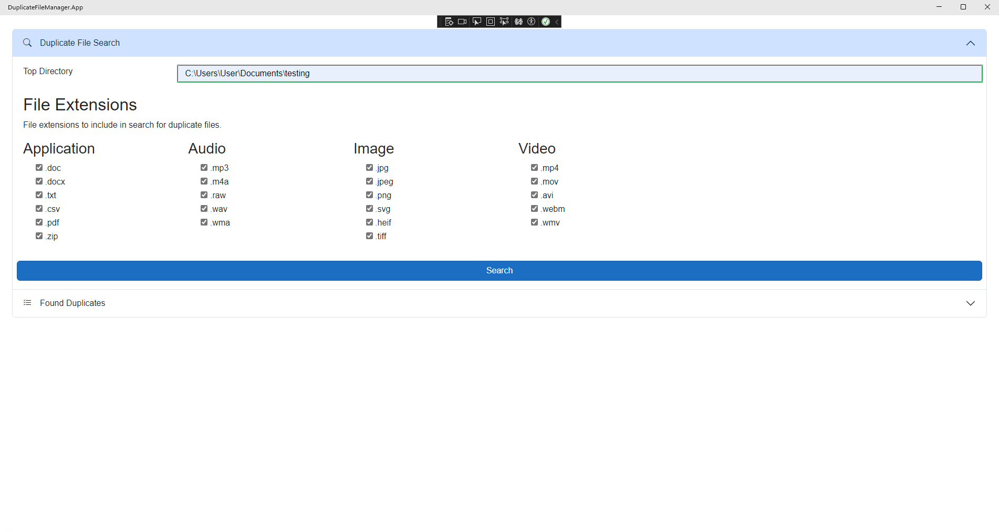

# Duplicate File Manager

Duplicate File Manager is a desktop app that runs on a dotnet Maui Hybrid app. Due to file access restrictions posed by Apple (and the fact that I'm making this for someone who only uses Windows computers) this app only fully runs on Windows 10 and above. If you try running on a mac, it will return an Unauthorized exception.

The goal of the application is to allow users to find and delete duplicate files (verified using a file hash) in a specified folder. Please note, this will take a while to run if you use the root of a drive, as it runs recursively for that file and retrieves the hash for each file in the selected folder. It will also likely use a large amount of your CPU, as it runs that process in parallel.

## Screenshots

Search Form

List of duplicate files

Recycle Bin

